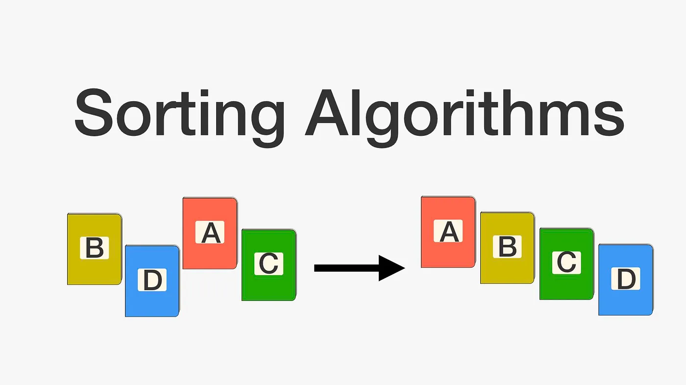

 

## 🧐 Why Do we have to study sorting algorithm?

**Sorting algorithms** are a fundamental topic that every developer should study at least once. It's one of the most common and essential concepts in programming. But Sometimes we overlook the importance of sorting algorithms because we work with them so frequently.  
However, we should look at this from a different perspective - the fact that it's such a common topic actually highlights how important it is.

But When you study sort algorithm at first time, You can feel like

> "Sorting? Isn't it just arranging data in order? Is it really that important?"

Sorting might seem simple at first glance. The main point is correct - all we need to do is **arrange data in order**

 

## ❓ The real question is `"How?"`

The key question is **"How"** when it comes to `Sorting Algorithm`.
Sorting algorithm are diverse, and the choice of which algorithm to use can make a world of difference in the results. A sorting task that could be completed in one second might take 10 minutes, while a problem that seems to require 10 minutes could be solved in just one second.

For example, imagine we have N students in a class and we need to arrange them in order based on their test scores. In a basic approach, we can randomly select one student and compare their score with another student's score. When we find a student with a lower score, we continue comparing that student's score with others. We repeat this process N-1 times. Through this method, we can identify the student with the lowest score and place them at the front of the line.

After that, we simply repeat the same process with the remaining N-1 students.
So, how many comparisons do we need to make to arrange all students in order?

### N-1 + N-2 + … + 3 + 2 + 1 = N(N-1)/2

We need N(N-1)/2 comparisons to arrange them correctly.
Let's imagine each comparison takes one second and we have 10 students.
That means 10 \* 9 / 2 = 45. We can arrange them in 45 seconds.
However, if we have 100 students, it would take 1.375 hours.
And if we have 1000 students, it would take 138.75 hours.
As the number of students increases, the number of required comparison operations grows **exponentially**

 

## 🚨 The importance of sorting algorithm

From the previous example, we can see that the number of required comparison operations grows exponentially as the amount of data increases.So how do services like YouTube and TikTok, which have massive amounts of data that need to be sorted, handle this?

Do they rely on supercomputers with extraordinary computing power?
This wouldn't make sense financially, and it's not a fundamental solution either.
For example, you wouldn't use a supercomputer just to run a service with only 1000 users.

 

## ⭐ The soloution lies in the sorting algorithm

We can solve the problem of exponentially increasing comparison operations by changing our sorting method.
The previous sorting method has a time complexity of **O(n^2)**.
This notation is called **Big O Notation**, which I'll explain in a later post. For now, you can roughly think of it as how the processing time increases based on the input size N.

However, if we change our sorting algorithm, we can solve it with a time complexity of **O(n log n)**.
For example, if we use the **merge sorting algorithm**, which has a time complexity of O(n log n), arranging 1000 students would only take 2.77 hours.
This is a dramatic decrease compared to the previous method which took 138.75 hours.
In reality, each comparison would take much less than one second, so the actual time would be just a matter of seconds.

 

## 🤨 But why do I still need to study this?

Can't We just use the well-designed sorting libraries created by brilliant developers?  
Yes, we can. In fact, we don't need to implement sorting algorithms from scratch.
In most situations, it's more efficient **to use well-designed tools** created by others.  
So why do we need to study sorting algorithms? The answer lies in learning different approaches to solve computational problems from various perspectives.

Sorting algorithms are all about finding more efficient ways to solve problems

From studying sorting algorithms, we can learn following problem-solving strategies:

- **Divide the problem into smaller parts** : Break the problem into manageable pieces and solve it stepby step (e.g. the Divide and Conquer approach in Merge Sort)
- **Leverage randomness** : Use randomness to approach the problem or optimize performance (e.g. the random pivot selection of Quick Sort)
- **Utilize specialized data structures** : Choose or implement data structure that best suit the problem. (e.g. the hepa structure used in Heap Sort).

Additionally, we can learn how to measure and evaluate algorithm performance.
This is a crucial perspective when dealing with large-scale computational problems.

- Using **Big O Notation** to analyze time and space complexity of algorithms
- Selecting appropriate algorithms by considering both **average and worst-case scenarios**
- Understanding **Trade-offs** : Balancing memory usage and operational speed

 

## 🎈 Conclusion

The reason we study sorting algorithms is not merely to implement code.  
Through them, we develop **computational thinking**, learn efficient problem-solveing techniques, and gain practical intuition for software design.  
Sorting algorithms serve as an excellent tool for practicing diverse problem-solving stragegies and critical thinking skills.  
**In the end, studying sorting algorithms is about building the foundational strength needed to grow as a software engineer! 💪**
